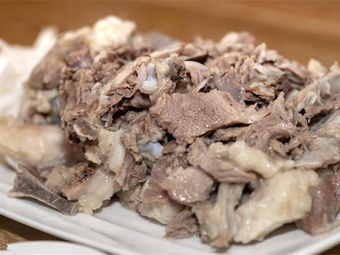
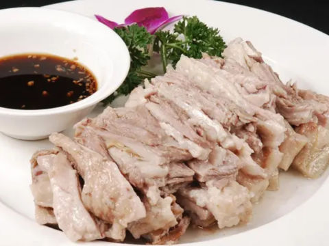

# 民勤清炖羊肉做法

1.羊肉剁成块，用清水洗羊肉把血水洗掉。
2.把羊肉放入锅内，然后添上清水，开始煮。
3.等水马上开了，以后上面就有血沫，用漏勺把血沫舀出来。
4.血沫去掉以后，水开了，就开始下大料。
大料有：生姜5、6片，草果1个，花椒一嘬嘬，山奈，香叶，良姜，百籽，料酒（前三个最主要）。小火慢炖。
5.八成熟后，用筷子戳动时，放入盐。继续煮，小火慢炖
6.熟了以后，把香菜，蒜苗花放出，舀出即可

以上内容，由我父亲口述，我记录而成。

[back](./list-cookbook.md)